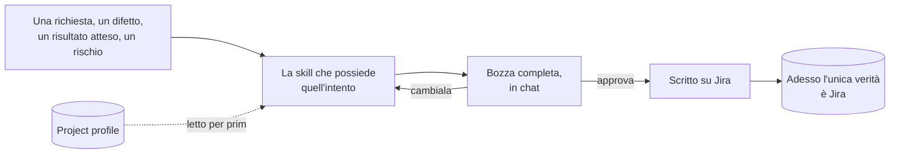

# jira-skills

[](LICENSE)
[](https://www.npmjs.com/package/@codeskine/jira-skills)
[](https://docs.claude.com/en/docs/claude-code)

[English](README.md) · **Italiano**

Agent Skills per Claude Code che scrivono i work item di un progetto su **Atlassian Jira Cloud** —
registrare richieste, proporre valore, segnalare difetti, mettere agli atti il debito tecnico,
fare refinement e scomporre, pianificare sprint e fix version.

Il perimetro è il **tracker**. Codice, branch, proposte di modifica e rilascio tecnico sono fuori
per decisione, non per dimenticanza.

## Come funziona

Dici quello che vuoi con parole tue. La skill che possiede quell'intento si carica, legge il
**project profile** per sapere com'è davvero configurato il tuo progetto Jira, fa le domande che
farebbe la sua persona, assembla il work item e te lo mostra in chat. Su Jira non viene scritto
niente finché non approvi.



Da questa forma discendono due cose, e sono tutto il progetto:

- **Del tuo progetto non si dà niente per scontato.** Work type, status, transition, profondità
  della gerarchia, board e fix version appartengono al tuo schema. `jira-init` li scopre una volta
  e li registra in un project profile che il team committa; ogni altra skill lo legge e si ferma
  se manca, invece di tirare a indovinare.
- **Non si inventa niente che Jira già possieda.** Nessuna label di status, nessuna label di tipo,
  nessuna tabella dei figli mantenuta a mano. Dove Jira ha il concetto, le skill lo scoprono e ti
  ci accompagnano.

**[Leggi il processo di sviluppo](docs/development-process.it.md)** per il percorso completo — la
discovery, il draft gate, i due channel e i buchi che dichiarano — con i diagrammi. È la pagina da
leggere prima di installare.

## Cosa c'è in questo repository

| Percorso                         | Cosa contiene                                                                          |
| -------------------------------- | -------------------------------------------------------------------------------------- |
| `skills/`                        | le dieci Agent Skill, una directory ciascuna, più `shared/` per quello che condividono |
| `commands/`                      | gli slash command — per ora `/jira-doctor`                                             |
| `docs/skills/`                   | una pagina di documentazione per skill, in inglese e in italiano                       |
| `docs/commands/`                 | la stessa cosa, per comando                                                            |
| `docs/development-process.it.md` | i meccanismi condivisi e il percorso completo, con i diagrammi                         |
| `docs/termbase.md`               | la tabella dei termini inglese ↔ italiano contro cui la documentazione è scritta       |
| `docs/adr/`                      | i record delle decisioni architetturali                                                |
| `docs/agents/`                   | le procedure per gli agenti che lavorano su questo repository                          |
| `scripts/`                       | i controlli di integrità e i generatori                                                |
| `.claude-plugin/`                | i metadati del plugin e la voce di marketplace                                         |

## Requisiti

| Cosa                                 | Perché                                                                                                                                                                                                                                                                                                                                     |
| ------------------------------------ | ------------------------------------------------------------------------------------------------------------------------------------------------------------------------------------------------------------------------------------------------------------------------------------------------------------------------------------------ |
| Claude Code                          | L'unico harness a cui questo plugin si rivolge                                                                                                                                                                                                                                                                                             |
| L'Atlassian MCP server               | Work item, campi, commenti, transition, ricerca e metadati di progetto                                                                                                                                                                                                                                                                     |
| — raggiungibile con l'id `atlassian` | Le skill dichiarano quell'id staticamente, quindi un server con qualunque altro nome per loro non esiste. Un connettore Atlassian aggiunto dalle impostazioni di claude.ai è uno di quei nomi: risulta connesso, espone i suoi tool sotto un identificatore proprio, e non serve nessuna skill qui. Aggiungere `atlassian` non lo disturba |
| La `jira` CLI, autenticata           | Solo per la superficie Agile — board, sprint, backlog. Senza, `jira-plan` e l'elenco delle fix version non sono disponibili e tutto il resto continua a funzionare                                                                                                                                                                         |

Il modo più semplice per ottenere quell'id è un `.mcp.json` alla radice del repository dove tracci
il lavoro:

```json
{
  "mcpServers": {
    "atlassian": {
      "type": "http",
      "url": "https://mcp.atlassian.com/v1/mcp"
    }
  }
}
```

Claude Code ti chiede di approvarlo la volta successiva che apri il repository, e l'autenticazione
la fai tu. Contiene una URL e nessuna credenziale, quindi committalo: il team configura il server
una volta sola invece che ciascuno sulla propria macchina. Se preferisci averlo sulla tua macchina
anziché nel repository, `claude mcp add --transport http atlassian https://mcp.atlassian.com/v1/mcp`
fa lo stesso lavoro — quello che conta è l'id, non l'ambito.

Esegui [`/jira-doctor`](docs/commands/jira-doctor.it.md) per verificarli tutti e tre insieme.
Segnala ogni fallimento con il rimedio esatto, e ti dice quale metà del plugin è degradata invece
di fallire in blocco.

## Installazione

```bash
claude plugin install @codeskine/jira-skills
```

Poi, nel repository dove tracci il lavoro:

```
/jira-doctor
```

e, quando è contento:

```
jira-init
```

`jira-init` scopre il tuo progetto e scrive `.jira/project-profile.md`. Committalo: è così che
tutto il team, e ogni sessione futura, impara gli stessi fatti senza richiederli a Jira.

## Le skill

Ogni riga rimanda alla pagina di quella skill: cosa fa, quando si attiva, uno scambio di esempio, e
l'artefatto o il report che produce.

<!-- skills:start -->

**Setup** — Scopri com'è davvero configurato il progetto Jira e registra il project profile che ogni altra skill legge.

| Skill       | Cosa fa                                                                                                                                                                                               | Pagina                               |
| ----------- | ----------------------------------------------------------------------------------------------------------------------------------------------------------------------------------------------------- | ------------------------------------ |
| `jira-init` | Jira project discovery. Use when the user sets up this plugin on a repository, asks how their Jira project is configured, or when another skill reports that the project profile is missing or stale. | [leggi](docs/skills/jira-init.it.md) |

**Redazione** — Trasforma una richiesta, un difetto o un rischio tecnico in un work item Jira fatto bene.

| Skill           | Cosa fa                                                                                                                                                                                                                                                            | Pagina                                   |
| --------------- | ------------------------------------------------------------------------------------------------------------------------------------------------------------------------------------------------------------------------------------------------------------------ | ---------------------------------------- |
| `jira-capture`  | Jira intake author. Use when a request arrives from outside the team — an email, a chat message, a note taken during a call — and has to be recorded on Jira before anyone has understood it, without losing the wording it arrived in.                            | [leggi](docs/skills/jira-capture.it.md)  |
| `jira-propose`  | Jira value proposal author. Use when someone wants an outcome recorded on Jira in a form that survives a prioritisation discussion — the value sought, who benefits, how success will be known.                                                                    | [leggi](docs/skills/jira-propose.it.md)  |
| `jira-diagnose` | Jira defect author. Use when the user reports that something is broken, behaves unexpectedly, or fails — and it has to reach Jira in a form someone who was not there can reproduce.                                                                               | [leggi](docs/skills/jira-diagnose.it.md) |
| `jira-assess`   | Jira technical debt and risk author. Use when the user wants to record something that works today but will cost the team later — a shortcut taken deliberately, a dependency going stale, a design that no longer fits, an arrangement only two people understand. | [leggi](docs/skills/jira-assess.it.md)   |

**Refinement** — Arricchisci un work item e scomponilo in figli completi.

| Skill         | Cosa fa                                                                                                                                                                                                                                            | Pagina                                 |
| ------------- | -------------------------------------------------------------------------------------------------------------------------------------------------------------------------------------------------------------------------------------------------- | -------------------------------------- |
| `jira-refine` | Jira refinement author. Use when an existing Jira work item has to become something a team can pick up — acceptance criteria agreed, scope small enough to finish, dependencies linked — or when it is too large and must be broken into children. | [leggi](docs/skills/jira-refine.it.md) |

**Pianificazione** — Decidi quando il lavoro viene affrontato e cosa esce insieme.

| Skill          | Cosa fa                                                                                                                                                                       | Pagina                                  |
| -------------- | ----------------------------------------------------------------------------------------------------------------------------------------------------------------------------- | --------------------------------------- |
| `jira-plan`    | Jira sprint planner. Use when the user asks what is in the current sprint, wants to fill or empty one, or wants to close one and see what was delivered.                      | [leggi](docs/skills/jira-plan.it.md)    |
| `jira-release` | Jira fix version manager. Use when the user asks what a Jira fix version contains, wants to assign work to one, or wants to know what is still unfinished before shipping it. | [leggi](docs/skills/jira-release.it.md) |

**Avanzamento** — Fai avanzare un work item nel suo Jira Workflow e leggi a che punto sta.

| Skill          | Cosa fa                                                                                                                                                                                                                                                      | Pagina                                  |
| -------------- | ------------------------------------------------------------------------------------------------------------------------------------------------------------------------------------------------------------------------------------------------------------ | --------------------------------------- |
| `jira-advance` | Jira transition runner. Use when the user wants a Jira work item to reach its next status — start it, hand it over, put it back, close it — without opening Jira.                                                                                            | [leggi](docs/skills/jira-advance.it.md) |
| `jira-inspect` | Jira read-only reporter. Use when the user asks where something stands on Jira — how a parent and its children are progressing, what a sprint has left, what is blocked, what a fix version currently contains — and expects an answer rather than a change. | [leggi](docs/skills/jira-inspect.it.md) |

<!-- skills:end -->

## Cosa questo plugin non farà

Fuori per decisione, e messo agli atti come tale:

- **Merge request, pull request, commit, branch e rilascio tecnico.** Appartengono a un altro
  plugin, non a una versione futura di questo.
- **L'amministrazione di Jira.** Work type, status, Jira Workflow, schemi, board e permessi si
  scoprono e non si toccano mai.
- **Qualunque tracker diverso da Jira Cloud.** L'astrazione che l'avrebbe permesso è stata rimossa
  deliberatamente.
- **Confluence**, e ogni altro prodotto Atlassian.
- **Qualunque copia locale di ciò che è stato pubblicato.** Dopo una scrittura la verità è Jira.

Tre operazioni non sono disponibili su nessuno dei due channel e ti vengono restituite invece che
simulate: creare uno sprint, e creare o rilasciare una fix version. Le skill lo dicono prima che tu
lo chieda.

## Contribuire

`CLAUDE.md` contiene gli standard di redazione — frontmatter, budget di token, gli invarianti
obbligatori e i confini fra le skill. `CONTEXT.md` è il glossario, ed elenca le parole che questo
progetto rifiuta oltre a quelle che usa. `docs/termbase.md` estende quel glossario all'italiano,
per la documentazione.

Questo repository porta il proprio `.mcp.json`, che dichiara il server Atlassian con l'id che le
skill richiedono — lo stesso file descritto sotto [Requisiti](#requisiti), qui perché provare il
plugin non significhi mai riconfigurare l'ambiente in cui lavori.

Prima di aprire una modifica:

```bash
node scripts/check-package.mjs
node scripts/generate-readme-table.mjs
node scripts/check-docs.mjs
```

Il primo fallisce se il manifest, il file di versione e la directory delle skill non concordano, o
se un frontmatter si comporterebbe male una volta installato. Il secondo rigenera ogni blocco che
ripete un fatto già portato da una skill — entrambe le tabelle del README e l'header di ogni pagina
di documentazione — così che non possano divergere; quei blocchi non si modificano mai a mano. Il
terzo fallisce se a una skill o a un comando manca la coppia di documenti, se una pagina ha perso
una delle sue sezioni, o se un link è rotto.

Se cambi cosa accettano le regole del frontmatter, esegui anche `npm test`: copre il lettore e un
caso per regola, con il solo Node, ed è ciò che dice che il controllo significa ancora quello che
dichiara.

## Licenza

MIT. Vedi [LICENSE](LICENSE).
