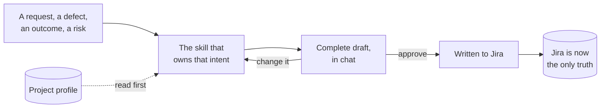

# jira-skills

Claude Code Agent Skills for authoring the work items of a project on **Atlassian Jira Cloud** —
capturing requests, proposing value, reporting defects, recording technical debt, refining and
decomposing, planning sprints and fix versions.

The perimeter is the **tracker**. Code, branches, change proposals and technical release are out
of scope by decision, not by omission.

## How it works

You say what you want in your own words. The skill that owns that intent loads, reads the
**project profile** to learn how your Jira project is actually configured, asks the questions its
persona would ask, assembles the work item, and shows it to you in chat. Nothing is written to
Jira until you approve it.



Two things follow from that shape, and they are the whole design:

- **Nothing is assumed about your project.** Work types, statuses, transitions, hierarchy depth,
  boards and fix versions belong to your project scheme. `jira-init` discovers them once and
  records them in a profile your team commits; every other skill reads it and stops if it is
  missing rather than guessing.
- **Nothing is invented that Jira already owns.** No status labels, no type labels, no
  hand-maintained table of children. Where Jira has the concept, the skills discover it and guide
  you to it.

## Requirements

| What                             | Why                                                                                   |
| -------------------------------- | ------------------------------------------------------------------------------------- |
| Claude Code                      | The only harness this plugin targets                                                  |
| The Atlassian MCP server         | Work items, fields, comments, transitions, search and project metadata                |
| — reachable under the id `atlassian` | Skills declare that id statically, so a server under any other name is invisible to them. An Atlassian connector added through claude.ai settings may show as connected and still not serve them — `/jira-doctor` tells you which situation you are in |
| The `jira` CLI, authenticated    | Only for the Agile surface — boards, sprints, backlog. Without it, `jira-plan` and the fix-version listing are unavailable and everything else still works |

Add it under that id with `claude mcp add --transport http atlassian https://mcp.atlassian.com/v1/mcp`,
then authenticate it.

Run `/jira-doctor` to check all three at once. It reports each failure with the exact remediation,
and tells you which half of the plugin is degraded rather than failing as a whole.

## Installation

```bash
claude plugin install @codeskine/jira-skills
```

Then, in the repository where your work is tracked:

```
/jira-doctor
```

and, once it is happy:

```
jira-init
```

`jira-init` discovers your project and writes `.jira/project-profile.md`. Commit it: it is how
your whole team, and every future session, learns the same facts without asking Jira again.

## Skills

<!-- skills:start -->

**Setup** — Discover how the Jira project is really configured and record the project profile every other skill reads.

| Skill | What it does |
| ----- | ------------ |
| `jira-init` | Jira project discovery. Use when the user sets up this plugin on a repository, asks how their Jira project is configured, or when another skill reports that the project profile is missing or stale. |

**Authoring** — Turn a request, a defect or a technical risk into a well-formed Jira work item.

| Skill | What it does |
| ----- | ------------ |
| `jira-capture` | Jira intake author. Use when a request arrives from outside the team — an email, a chat message, a note taken during a call — and has to be recorded on Jira before anyone has understood it, without losing the wording it arrived in. |
| `jira-propose` | Jira value proposal author. Use when someone wants an outcome recorded on Jira in a form that survives a prioritisation discussion — the value sought, who benefits, how success will be known. |
| `jira-diagnose` | Jira defect author. Use when the user reports that something is broken, behaves unexpectedly, or fails — and it has to reach Jira in a form someone who was not there can reproduce. |
| `jira-assess` | Jira technical debt and risk author. Use when the user wants to record something that works today but will cost the team later — a shortcut taken deliberately, a dependency going stale, a design that no longer fits, an arrangement only two people understand. |

**Refinement** — Enrich a work item and break it down into well-formed children.

| Skill | What it does |
| ----- | ------------ |
| `jira-refine` | Jira refinement author. Use when an existing Jira work item has to become something a team can pick up — acceptance criteria agreed, scope small enough to finish, dependencies linked — or when it is too large and must be broken into children. |

**Planning** — Decide when work is tackled and what ships together.

| Skill | What it does |
| ----- | ------------ |
| `jira-plan` | Jira sprint planner. Use when the user asks what is in the current sprint, wants to fill or empty one, or wants to close one and see what was delivered. |
| `jira-release` | Jira fix version manager. Use when the user asks what a Jira fix version contains, wants to assign work to one, or wants to know what is still unfinished before shipping it. |

**Progress** — Move work along its workflow and read where it stands.

| Skill | What it does |
| ----- | ------------ |
| `jira-advance` | Jira transition runner. Use when the user wants a Jira work item to reach its next status — start it, hand it over, put it back, close it — without opening Jira. |
| `jira-inspect` | Jira read-only reporter. Use when the user asks where something stands on Jira — how a parent and its children are progressing, what a sprint has left, what is blocked, what a fix version currently contains — and expects an answer rather than a change. |

<!-- skills:end -->

## What this plugin will not do

Out by decision, and recorded as such:

- **Merge requests, pull requests, commits, branches and technical release.** They belong to a
  different plugin, not to a later version of this one.
- **Jira administration.** Work types, statuses, workflows, schemes, boards and permissions are
  discovered and never changed.
- **Any tracker other than Jira Cloud.** The abstraction that would have allowed it was
  deliberately removed.
- **Confluence**, and every other Atlassian product.
- **Any local mirror of what was published.** After a write, the truth is Jira.

Three operations are unavailable on both channels and are handed back to you rather than
simulated: creating a sprint, and creating or releasing a fix version. The skills say so before
you ask.

## Contributing

`CLAUDE.md` holds the authoring standards — frontmatter, token budgets, the mandatory invariants
and the boundaries between skills. `CONTEXT.md` is the glossary, and it lists the words this
project refuses to use as well as the ones it uses.

Before opening a change:

```bash
node scripts/check-package.mjs
node scripts/generate-readme-table.mjs
```

The first fails if the manifest, the version file and the skills directory disagree, or if any
frontmatter would misbehave once installed. The second regenerates the table above from the
skills themselves — it is generated precisely so that it cannot drift, so never edit it by hand.

## License

MIT. See [LICENSE](LICENSE).
