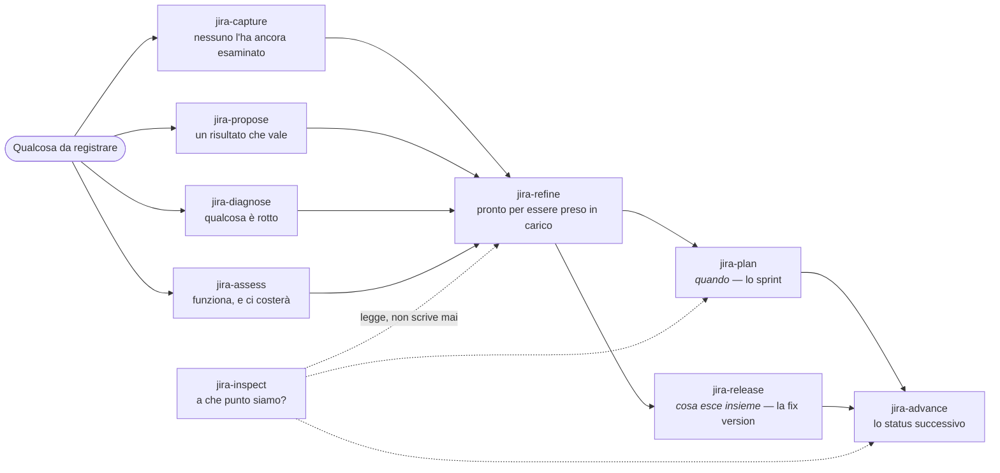
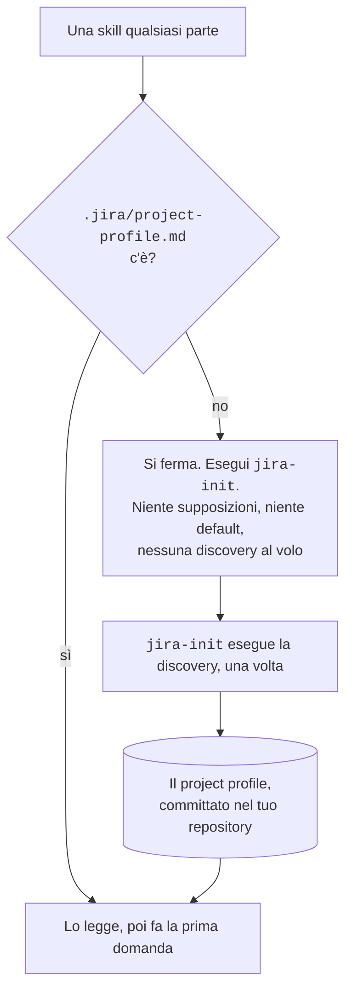
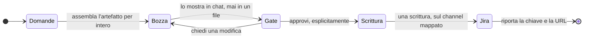
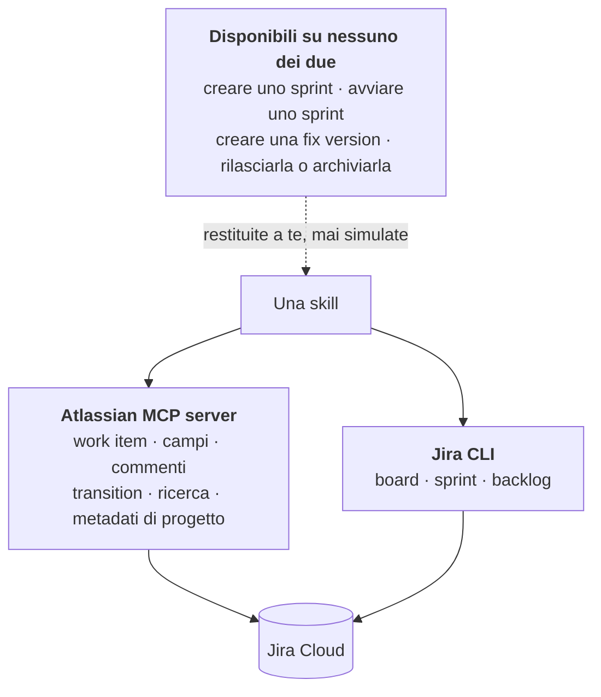

# Il processo di sviluppo

Il percorso che va da qualcosa che vale la pena registrare a qualcosa che è stato rilasciato, e i
quattro meccanismi che ogni skill condivide lungo la strada. Le singole pagine descrivono un
intento ciascuna; questa descrive quello che le tiene insieme, così che undici documenti non
debbano spiegare undici volte lo stesso cancello.

Se prima di installare il plugin leggi una pagina sola, leggi questa.

---

## La forma d'insieme

Quattro cose entrano, una skill le rende pronte, due decidono _quando_ e _cosa esce insieme_, una
le muove, una legge. `jira-plan` e `jira-release` stanno affiancate e non in sequenza perché uno
sprint e una fix version sono assi ortogonali: un work item può appartenere a entrambi, e
rispondere a _quando_ non ha mai risposto a _cosa esce insieme_.

Il confine fra le skill è **l'intento che esprimi**, mai il work type che ne risulta. Dieci skill
possono scrivere lo stesso oggetto Jira; a separarle è la domanda che ti fanno per prima.

---

## Del tuo progetto non si dà niente per scontato

Work type, status, transition, profondità della gerarchia, board e fix version appartengono a chi
amministra il tuo progetto Jira. Questo plugin li legge e non li ricrea mai.

**La discovery — la lettura della configurazione reale del progetto — gira una volta sola**, in
[`jira-init`](skills/jira-init.it.md), e il suo esito finisce in `.jira/project-profile.md`. Ogni
altra skill legge quel file come primo passo. Committalo: è così che tutto il team, e ogni
sessione futura, impara gli stessi fatti senza richiederli a Jira.

Cosa registra, e perché ogni voce si guadagna il posto:

| Registra                                          | Perché altrimenti una skill                              |
| ------------------------------------------------- | -------------------------------------------------------- |
| chiave e nome del progetto                        | non saprebbe su cosa sta agendo                          |
| i work type, e come si annidano                   | offrirebbe un tipo inesistente, a un livello impossibile |
| gli status e le transition che li collegano       | dedurrebbe un movimento che Jira rifiuta                 |
| i campi obbligatori alla creazione, per work type | si vedrebbe rifiutare una bozza che avevi già approvato  |
| le board, e lo sprint attivo di ciascuna          | pianificherebbe su uno sprint che non c'è                |
| le fix version                                    | se ne inventerebbe una                                   |
| quale tool MCP serve quale operazione             | fisserebbe un nome di tool che cambia fra le versioni    |
| le operazioni per cui non esiste alcun tool       | fallirebbe dove poteva annunciare un limite              |

Tre proprietà del project profile conviene conoscerle prima di incontrarle:

- **Un repository, un progetto.** Rieseguire la discovery sostituisce il project profile, non lo
  amplia. Lavorare su due progetti Jira da un solo repository non è supportato.
- **Gli status sono osservabili solo dove il lavoro esiste già.** Si leggono dai work item che li
  occupano, quindi un progetto che non ne contiene nessuno non ne espone nessuno — ed è lo stato
  di ogni progetto il giorno in cui nasce, spesso lo stesso in cui si installa questo plugin. Un
  project profile senza status è comunque valido, purché dica che non erano ancora osservabili.
- **Solo `jira-init` lo scrive.** Tutte le altre skill lo leggono. Una skill che trova il project
  profile in disaccordo con Jira lo segnala e nomina `jira-init`; non ripara il file di nascosto.

L'invalidazione è esplicita, mai a tempo. Riesegui `jira-init` quando lo schema cambia, quando
viene aggiunto uno status o una transition, o quando compare una board o una fix version che il
project profile non elenca.

### Un nome non è un genere

Sprint, fix version e status sono tutti soltanto nomi, e un nome non dice di che genere sia. `2.4`
è plausibile come sprint quanto come fix version. `To Do` è uno status nel tuo progetto e una
colonna di board in quello di qualcun altro. `Backlog` è una collocazione, e in certi schemi anche
uno status.

Niente nelle parole che usi può deciderlo, e il plugin non finge il contrario. La skill che scatta
legge prima il tuo profile, e solo allora sa cos'è `2.4` nel **tuo** progetto. Se combacia un
genere solo, prosegue e la domanda non la vedi nemmeno. Se ne combaciano due, ti chiede quale
intendevi e dice cosa farebbe ciascuna — non risolve l'ambiguità a favore del genere che possiede,
il che sembrerebbe sicurezza e sarebbe un lancio di moneta. Se non ne combacia nessuno, ti dice
cosa il tuo progetto ha davvero, perché un nome che non c'è è più spesso un refuso o un profile
vecchio che una cosa da andare a creare.

E se nomini un contenitore che nessuna skill possiede — una board, di solito — te lo dice. Una
board è un filtro sui work item; niente di quello che i due channel offrono toglie un work item da
una board. Lo ottieni come risposta netta invece che come l'operazione più vicina fra quelle
possibili.

<!-- shot:SHOT-01 pending -->

> **SHOT-01** · screenshot da catturare — `jira-init` che presenta quello che ha scoperto, subito
> prima di scrivere il project profile: i work type con la loro gerarchia, e le operazioni per cui
> non ha trovato alcun tool.

---

## Niente viene scritto prima che tu l'abbia visto

Questo è il **draft gate**, il cancello che precede ogni scrittura su Jira, ed è un cancello solo
in tutte le skill che scrivono. Quello che ci arriva ha una di due forme, decisa da cosa produce la
scrittura e non da quale skill sta girando.

**Quando qualcosa viene scritto ex novo** — una richiesta registrata, una proposta, la segnalazione
di un difetto, un debito, i figli di uno split — ricevi il contenuto esatto che verrà scritto, non
un riassunto e non una scaletta, nella lingua in cui stai lavorando. Con esso le decisioni che
porta con sé: il titolo, il work type, il parent se c'è, lo sprint e la fix version se ci sono,
tutto ciò che il tuo progetto marca obbligatorio e che la bozza ha lasciato vuoto, e — se il tuo
schema non ha un work type per quell'intento — sotto quale tipo viene archiviato invece.

**Quando cambia qualcosa che esiste già** — uno sprint riempito o chiuso, del lavoro assegnato a
una fix version o tolto da una, un work item portato allo status successivo — non c'è nessun
documento da mostrarti, quindi ricevi il cambiamento stesso: ogni work item che tocca, nominato,
con cosa cambia di ciascuno, cosa sarà vero dopo, e cosa l'operazione **non** farà là dove
potresti ragionevolmente aspettartelo. È quest'ultimo il punto della forma. Chiudere uno sprint non
può collocare il lavoro rimasto aperto dentro, e sentirselo dire al cancello è la differenza fra
approvare un esito e scoprirlo.

Poi approvi, oppure chiedi modifiche e lo rivedi — quante volte vuoi — oppure dici di no. Dire di
no è una risposta e viene trattata come tale: non viene scritto niente, ti viene detto cosa vale
adesso al suo posto, e non ti viene riproposta una versione più piccola della stessa cosa sperando
che passi quella. Se ciò che hai rifiutato è qualcosa su cui altre skill contano, te le nomina. Il
caso che conta è il rifiuto del project profile, perché senza di esso ogni altra skill si ferma al
primo passo.

- **L'approvazione è esplicita.** Non il silenzio, non un messaggio su altro, e non la tua
  richiesta iniziale: la richiesta è ciò che ha prodotto la bozza, non ciò che la approva.
- **Alcune skill scrivono più cose con una sola approvazione** — una scomposizione che crea figli,
  un insieme di work item spostati in uno sprint. Il cancello resta unico: si presenta tutto, si
  approva una volta, poi si esegue. Se una parte fallisce ti viene detto quali sono riuscite, e
  sei tu a decidere se tenere il risultato parziale.
- **«Per intero» vuol dire per intero.** Ci sono tutte le sezioni che il template definisce e non
  marca come facoltative. Una sezione che non si riesce a compilare viene sollevata al cancello
  come una lacuna, mai lasciata cadere in silenzio: la facoltatività la dichiara il template, non
  si deduce dal silenzio.
- **Dopo la scrittura la verità è Jira.** Di quello che è stato pubblicato non resta nessuna copia
  locale, da nessuna parte.

<!-- shot:SHOT-02 pending -->

> **SHOT-02** · screenshot da catturare — una bozza completa al cancello in una sessione Claude
> Code: l'artefatto, il blocco delle decisioni sotto di esso, e la domanda di approvazione.

---

## Due channel, e cosa succede quando uno è spento

Una skill non sceglie il proprio channel: cerca l'operazione in una mappa dichiarata una volta e
condivisa. Due channel e non uno perché nessuno dei due copre l'intero dominio — il server MCP non
espone la superficie Agile, e la CLI non è il channel che un agente parla nativamente.

**L'id del server è fissato per convenzione: `atlassian`.** Compare in frontmatter statico, che non
può leggere un file, quindi un server raggiungibile con qualunque altro nome non serve nessuna
skill di questo plugin, per quanto sano appaia. Un connettore Atlassian aggiunto dalle
impostazioni di claude.ai è esattamente uno di quei nomi.
[`/jira-doctor`](commands/jira-doctor.it.md) lo verifica e stampa il rimedio.

**Quattro operazioni non esistono su nessuno dei due channel** e ti vengono restituite invece che
simulate: creare uno sprint, avviarlo, creare una fix version, e rilasciarla o archiviarla. Le
skill lo dicono prima che tu lo chieda. Sono gap degli strumenti, e valgono ovunque.

**Un channel semplicemente irraggiungibile sulla tua macchina è un'altra cosa**: è una
degradazione, torna quando torna il channel, e non dice niente sul tuo progetto. Senza una `jira`
CLI autenticata, [`jira-plan`](skills/jira-plan.it.md) e l'elenco delle fix version di
[`jira-release`](skills/jira-release.it.md) non sono disponibili; tutto il resto funziona. E la
CLI si spegne per due ragioni distinte che hanno due rimedi distinti — una credenziale che la
shell non interattiva non vede, oppure una configurazione mai generata. Nominare quello sbagliato
ti manda contro un muro, quindi [`/jira-doctor`](commands/jira-doctor.it.md) le distingue prima di
prescrivere.

---

## Cosa vuol dire «fatto bene»

Ogni artefatto che queste skill scrivono rispetta la stessa asticella, qualunque sia l'intento:

1. **Il titolo nomina la cosa, non l'attività.** Chi scorre un backlog deve capire di cosa si
   tratta senza aprirlo.
2. **La ragione è dichiarata** — perché conta, o cosa succede se non si fa.
3. **Ogni affermazione verificabile porta la sua evidenza**, nella forma che le si addice.
4. **Vocabolario canonico** — work item, work type, parent, status, transition, sprint, fix
   version. I sinonimi generici da tracker codificano un modello diverso: sono difetti, non stile.
5. **La lingua è la tua.** La struttura viene dal template, la lingua dalla conversazione. Nessuna
   delle due è fissata — i sette nomi qui sopra sono l'eccezione, e non si traducono.
6. **Nessuno stack tecnologico viene dato per scontato.**
7. **I campi obbligatori sono compilati o segnalati** al cancello, invece di far fallire la
   scrittura.
8. **Un work type sostitutivo è dichiarato dall'artefatto**, non solo al cancello.

L'evidenza è obbligatoria, e il codice è solo una delle sue forme:

| L'affermazione                             | L'evidenza                                                             |
| ------------------------------------------ | ---------------------------------------------------------------------- |
| il codice si comporta in un certo modo     | uno snippet di 5–20 righe, con citazione esatta `path/file.ext` riga N |
| qualcosa fallisce                          | l'errore o la riga di log esatti, verbatim, non parafrasati            |
| qualcosa è lento, grande o frequente       | la misura, e come è stata ottenuta                                     |
| gli utenti vogliono o faticano su qualcosa | l'osservazione, la richiesta, o il dato che c'è dietro                 |
| questo dipende da altro lavoro             | un link al work item, non una sua descrizione                          |
| è così che deve comportarsi                | un riferimento alla decisione o al documento che lo dice               |

Un artefatto senza contenuto verificabile è un'opinione, e si legge come tale — marcato come
assunzione invece che travestito da fatto.

---

## Non si inventa niente che Jira già possieda

Nessuna label di status, nessuna label di tipo, nessuna tabella dei figli mantenuta a mano,
nessuna copia locale di ciò che è stato pubblicato. Dove Jira ha il concetto, le skill lo scoprono
e ti ci accompagnano; dove Jira non ce l'ha, lo dicono e si fermano.

La gerarchia è il caso più chiaro. Un parent e i suoi figli sono interrogabili su Jira, quindi
nessuna skill scrive un elenco di figli dentro una descrizione: un elenco mantenuto a mano è una
seconda risposta che prima o poi contraddirà la prima.

<!-- shot:SHOT-03 pending -->

> **SHOT-03** · screenshot da catturare — il work item risultante su Jira dopo una scrittura: il
> work type, il parent e lo sprint come li mostra Jira stesso, senza nessun campo inventato dal
> plugin.

<!-- shot:SHOT-04 pending -->

> **SHOT-04** · screenshot da catturare — un parent con i suoi figli nella vista gerarchica di
> Jira, dopo una scomposizione fatta da `jira-refine`, a mostrare che quell'elenco non lo mantiene
> nessuno a mano.

---

## Il percorso completo, skill per skill

| Fase       | Skill                                         | Ottieni                                                   |
| ---------- | --------------------------------------------- | --------------------------------------------------------- |
| Setup      | [`jira-init`](skills/jira-init.it.md)         | il project profile, scoperto una volta e committato       |
| Setup      | [`/jira-doctor`](commands/jira-doctor.it.md)  | tre verifiche indipendenti, ognuna con il proprio rimedio |
| Intake     | [`jira-capture`](skills/jira-capture.it.md)   | una richiesta registrata con le parole con cui è arrivata |
| Intake     | [`jira-propose`](skills/jira-propose.it.md)   | un risultato atteso, con il dato che lo rende discutibile |
| Intake     | [`jira-diagnose`](skills/jira-diagnose.it.md) | un difetto che un altro riesce a riprodurre               |
| Intake     | [`jira-assess`](skills/jira-assess.it.md)     | debito o rischio, con quanto costa rimandarlo             |
| Refinement | [`jira-refine`](skills/jira-refine.it.md)     | criteri di accettazione, un perimetro finibile, o i figli |
| Planning   | [`jira-plan`](skills/jira-plan.it.md)         | uno sprint riempito o chiuso, e nominato ciò che ne esce  |
| Planning   | [`jira-release`](skills/jira-release.it.md)   | il contenuto di una fix version, e cosa resta aperto      |
| Progress   | [`jira-advance`](skills/jira-advance.it.md)   | le transition che Jira consente adesso, e nessun'altra    |
| Progress   | [`jira-inspect`](skills/jira-inspect.it.md)   | una risposta, e mai un cambiamento                        |

Solo `jira-capture` può produrre qualcosa di incompleto, e lo dichiara: quello che scrive è
esplicitamente grezzo e in attesa di refinement. Ogni altra skill è vincolata da una sola regola di
consegna — **nessuna skill crea un artefatto che un'altra skill dovrà rattoppare.**
