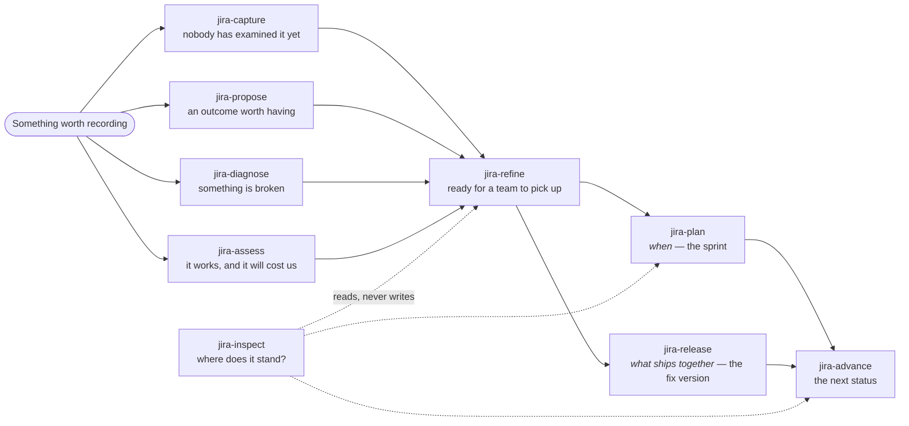
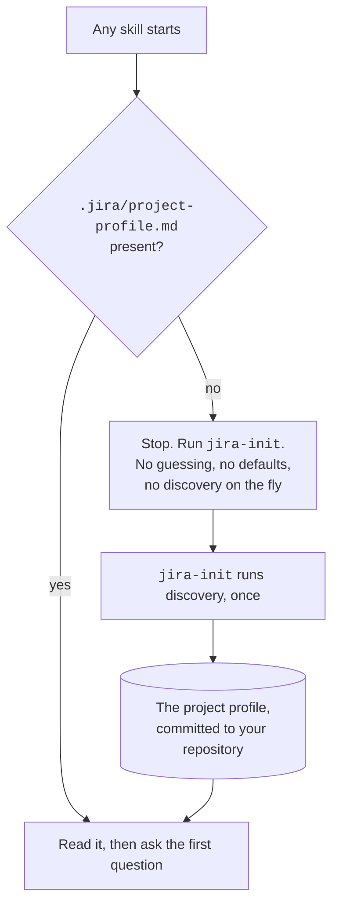
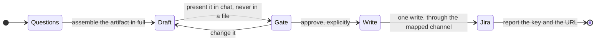
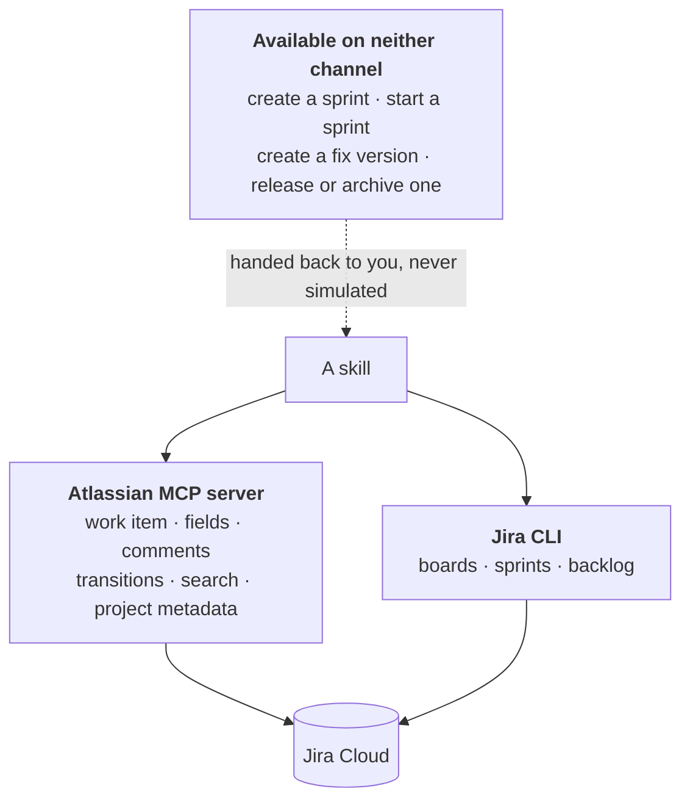

# The development process

The path from something worth recording to something that shipped, and the four mechanisms every
skill shares along the way. The individual pages describe one intent each; this one describes
what holds between them, so that eleven documents do not each explain the same gate.

If you read one page before installing the plugin, read this one.

---

## The shape of it

Four things enter, one skill makes them ready, two decide _when_ and _what ships_, one moves them,
one reads. `jira-plan` and `jira-release` sit side by side rather than in sequence because a
sprint and a fix version are orthogonal: a work item can belong to both, and answering _when_ has
never answered _what ships together_.

The boundary between skills is **the intent you express**, never the work type that results. Ten
skills can write the same Jira object; what separates them is which question they ask you first.

---

## Nothing is assumed about your project

Work types, statuses, transitions, hierarchy depth, boards and fix versions belong to whoever
administers your Jira project. This plugin reads them and never re-creates them.

**Discovery runs once**, in [`jira-init`](skills/jira-init.md), and its result is written to
`.jira/project-profile.md`. Every other skill reads that file as its first step. Commit it: it is
how your whole team, and every future session, learns the same facts without asking Jira again.

What it records, and why each entry earns its place:

| It records                                       | Because otherwise a skill would                          |
| ------------------------------------------------ | -------------------------------------------------------- |
| the project key and name                         | not know what it is scoped to                            |
| the work types, and how they nest                | offer a type that does not exist, at a level that cannot |
| the statuses and the transitions connecting them | infer a move Jira will refuse                            |
| the fields required on creation, per work type   | have a draft rejected after you approved it              |
| the boards, and the active sprint of each        | plan against a sprint that is not there                  |
| the fix versions                                 | invent one                                               |
| which MCP tool serves which operation            | hard-code a tool name that changes between versions      |
| the operations with no tool at all               | fail where it could have announced a limit               |

Three properties of the profile are worth knowing before you meet them:

- **One repository, one project.** Running discovery again replaces the profile rather than
  adding to it. Work spanning two Jira projects from one repository is not supported.
- **Statuses are observable only where work already exists.** They are read from the work item
  that occupy them, so a project holding none exposes none — which is the state of every project
  on the day it is created, and often the day this plugin is installed. A profile without them is
  still valid, provided it says they were not observable yet.
- **Only `jira-init` writes it.** Every other skill is a reader. A skill that finds the profile
  disagreeing with Jira reports it and names `jira-init`; it never repairs the file quietly.

Invalidation is explicit, never time-based. Re-run `jira-init` when the scheme changes, when a
status or transition is added, or when a board or fix version appears that the profile does not
list.

<!-- shot:SHOT-01 pending -->

> **SHOT-01** · screenshot to capture — `jira-init` presenting what it discovered, immediately
> before it writes the profile: the work types with their hierarchy, and the operations it found
> no tool for.

---

## Nothing is written before you have seen it

This is the **draft gate**, and it has one form across every skill that writes. What reaches the
gate is the exact content that will be written — not a summary, not an outline — in the language
you are working in.

Presented with it, you also get the decisions it carries: the title, the work type, the parent if
any, the sprint and the fix version if any, anything your project marks required that the draft
left empty, and — where your scheme has no work type for the intent — which type it is being
filed under instead.

Then you approve, or you ask for changes and see it again. As many times as you want.

- **Approval is explicit.** Not silence, not an unrelated message, and not your original request:
  the request is what produced the draft, not what approves it.
- **Some skills write several things under one approval** — a decomposition creating children, a
  set of work item moved into a sprint. The gate stays single: all of it is presented, approved
  once, then executed. If part of it fails you are told which parts succeeded, and you decide
  whether the partial result is kept.
- **After the write, Jira is the truth.** No local copy of what was published is kept, anywhere.

<!-- shot:SHOT-02 pending -->

> **SHOT-02** · screenshot to capture — a complete draft at the gate in a Claude Code session:
> the artifact, the block of decisions beneath it, and the approval question.

---

## Two channels, and what happens when one is dark

A skill does not choose its channel: it looks the operation up in a map declared once and shared.
Two channels rather than one because neither covers the whole domain — the MCP server does not
expose the Agile surface, and the CLI is not the channel an agent speaks natively.

**The server id is fixed by convention: `atlassian`.** It appears in static frontmatter that
cannot read a file, so a server reachable under any other name serves no skill here however
healthy it looks. An Atlassian connector added through claude.ai settings is exactly such a name.
[`/jira-doctor`](commands/jira-doctor.md) checks this and prints the remedy.

**Four operations exist on neither channel** and are handed back to you rather than simulated:
creating a sprint, starting one, creating a fix version, and releasing or archiving one. The
skills say so before you ask. These are gaps in the tooling and they hold everywhere.

**A channel that is merely unreachable on your machine is a different thing** — it is a
degradation, it returns when the channel does, and it says nothing about your project. Without an
authenticated `jira` CLI, [`jira-plan`](skills/jira-plan.md) and the fix version listing of
[`jira-release`](skills/jira-release.md) are unavailable; everything else works. And the CLI goes
dark for two distinct reasons that take two distinct remedies — a credential the non-interactive
shell cannot see, or a configuration that was never generated. Naming the wrong one sends you
against a wall, so [`/jira-doctor`](commands/jira-doctor.md) tells them apart before prescribing.

---

## What "good" means

Every artifact these skills write meets the same bar, whatever the intent:

1. **The title names the thing, not the activity.** Someone scanning a backlog should know what
   it is without opening it.
2. **The reason is stated** — why it matters, or what happens if it is not done.
3. **Every verifiable claim carries its evidence**, in the form that fits the claim.
4. **Canonical vocabulary** — work item, work type, parent, status, transition, sprint, fix
   version. Tracker-generic synonyms encode a different model and are defects, not style.
5. **The language is yours.** Structure comes from the template, language from the conversation.
   Neither is hard-coded — the seven names above are the exception, and they are not translated.
6. **No technology stack is assumed.**
7. **Required fields are filled or flagged** at the gate, rather than letting the write fail.
8. **A substituted work type is stated by the artifact**, not only at the gate.

Evidence is required, and code is only one of its forms:

| The claim                             | The evidence                                                                  |
| ------------------------------------- | ----------------------------------------------------------------------------- |
| code behaves a certain way            | a fenced snippet of 5–20 lines, with an exact `path/file.ext` line N citation |
| something fails                       | the exact error or log line, verbatim, not paraphrased                        |
| something is slow, large or frequent  | the measurement, and how it was obtained                                      |
| users want or struggle with something | the observation, the request, or the datum behind it                          |
| this depends on other work            | a link to the work item, not a description of it                              |
| this is how it is meant to behave     | a reference to the decision or document that says so                          |

An artifact with no checkable content is an opinion, and it reads as one — marked as an
assumption rather than dressed as a fact.

---

## Nothing is invented that Jira already owns

No status labels, no type labels, no hand-maintained table of children, no local mirror of what
was published. Where Jira has the concept, the skills discover it and guide you to it; where Jira
does not, they say so and stop.

The hierarchy is the clearest case. A parent and its children are queryable on Jira, so no skill
writes a list of children into a description: a list maintained by hand is a second answer that
will eventually disagree with the first.

<!-- shot:SHOT-03 pending -->

> **SHOT-03** · screenshot to capture — the resulting work item in Jira after a write: the work
> type, the parent, and the sprint as Jira itself shows them, with no field the plugin invented.

<!-- shot:SHOT-04 pending -->

> **SHOT-04** · screenshot to capture — a parent with its children in Jira's own hierarchy view,
> after a decomposition by `jira-refine`, showing that nothing maintains that list by hand.

---

## The whole path, skill by skill

| Phase      | Skill                                      | You get                                              |
| ---------- | ------------------------------------------ | ---------------------------------------------------- |
| Setup      | [`jira-init`](skills/jira-init.md)         | the project profile, discovered once and committed   |
| Setup      | [`/jira-doctor`](commands/jira-doctor.md)  | three independent checks, each with its own remedy   |
| Intake     | [`jira-capture`](skills/jira-capture.md)   | a request recorded in the words it arrived in        |
| Intake     | [`jira-propose`](skills/jira-propose.md)   | an outcome, with the datum that makes it arguable    |
| Intake     | [`jira-diagnose`](skills/jira-diagnose.md) | a defect someone else can reproduce                  |
| Intake     | [`jira-assess`](skills/jira-assess.md)     | debt or risk, with what deferring it costs           |
| Refinement | [`jira-refine`](skills/jira-refine.md)     | acceptance criteria, a finishable scope, or children |
| Planning   | [`jira-plan`](skills/jira-plan.md)         | a sprint filled, emptied or closed                   |
| Planning   | [`jira-release`](skills/jira-release.md)   | a fix version's contents, and what is unfinished     |
| Progress   | [`jira-advance`](skills/jira-advance.md)   | the transitions Jira allows right now, and no others |
| Progress   | [`jira-inspect`](skills/jira-inspect.md)   | an answer, and never a change                        |

Only `jira-capture` is allowed to produce something incomplete, and it declares it: what it
writes is explicitly raw and awaiting refinement. Every other skill is bound by one handover
rule — **no skill creates an artifact another skill will have to patch.**
